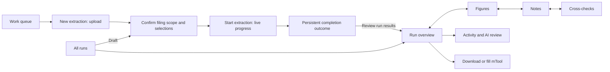

# Navigation journey audit and refactor

Scope: upload, setup, run monitoring, completion, review and output in the React UI.
Inspected on 5 September 2026. The tables below record the flow before this change,
followed by the implemented navigation contract.

## Existing journey and click destinations

| Surface | Control | Destination or effect before this change |
| --- | --- | --- |
| Sidebar | Work queue | `/`; clears a settled session. While a run is active, returns to its monitor. |
| Sidebar / queue | New extraction | Upload surface at `/#new-extraction`; sidebar resets the previous settled session. |
| Upload | Choose/drop PDF or Word | Uploads, saves a draft when possible, opens setup at `/run/{id}`. |
| Setup | Filing scope, statements, notes | Changes the saved extraction configuration. |
| Setup | Advanced settings | Reveals models, scan preparation, grading and repeat controls in place. |
| Setup | Start extraction | Starts the stream; replaces setup with live progress and agent activity at `/run/{id}`. |
| Live activity | Workstream / agent | Selects recorded/current activity within the monitor, not the editable output. |
| Live activity | Stop all / stop agent / retry | Mutates processing; retry is an explicit run action, not navigation. |
| Sidebar, after upload | Overview | Opens `/history/{id}?tab=overview`, even from setup or the live monitor. This is a different overview. |
| Sidebar | Figures review | Opens `/concepts/{id}`, an alias of the saved run page with Figures selected. |
| Sidebar | Notes review | Opens `/history/{id}?tab=notes`. |
| Live run, after completion | Summary / Data Preview / Downloads | Switches a separate results panel below activity; preview fetches result JSON. |
| Completion panel | Open run report | Opens saved run Overview at `/history/{id}`. |
| Completion panel | Review conflicts | Opens the Figures alias, another route from the same results panel. |
| Saved run | Overview / Activity / Notes / Cross-checks / AI review / Figures / optional Eval | Switches saved-run content; replaces the current browser history entry. |
| Figures / Notes | Run tabs | Tab bar disappears. Returning to other sections requires the sidebar or warning links. |
| Saved run | Back to runs | Always opens `/history`; does not retrace the previous click. |
| Overview | Review issues | Selected Cross-checks, even if the issue was an extraction warning with no failed check. |
| Figures | Statement, row, period, source page | Changes the review selection and PDF evidence within the same workspace. |
| Notes | Note index, sheet, source reference | Selects an editable note and its source within the same workspace. |
| Notes | Notes audit details | Expands coverage/integrity/table/reviewer evidence; this is supporting audit information. |
| Header | Download filled Excel / draft | Downloads the saved run workbook, with existing issue safeguards. |
| Overview | Fill mTool template | Opens output preparation; independent of Figures or Notes review. |
| Overview | Delete / Abort | Opens confirmation for the run action. |
| Sidebar | Runs | Searchable history at `/history`; selecting a draft resumes setup, another run opens its detail. |
| Header | Settings | Global settings at `/settings`; uploaded draft setup is kept mounted. |
| Sidebar tools | Field labels / Benchmarks / Evaluation suites | Separate template administration and quality evaluation tasks. |

## Why it was confusing

1. The sidebar repeated destinations already present in the run tabs, but the tabs
   vanished on the two main review screens. Navigation changed shape after a click.
2. A live overview and a saved overview shared the same label. The sidebar could
   move an operator from an unstarted draft or live monitor into another surface.
3. Completion appeared after a potentially long activity stream, with another set
   of summary, preview and download tabs before the actual review workspace.
4. Section navigation replaced browser history. Back could skip the last section,
   while the page's Back button always meant the run list.
5. Completed processing and reviewed/ready-to-file output were easy to conflate.
6. Run configuration and management controls competed with the review task.

## Implemented journey

The arrows between review sections show a suggested order, not mandatory steps.
Every available section remains directly reachable from the same tab bar.

- The sidebar has one **Current run** entry. It preserves the current section when
  already in that run and preserves the live monitor when processing is active.
- The run tab bar stays below the workspace header while scrolling and remains visible on Overview, Figures, Notes, Cross-checks,
  Activity and AI review. Eval still appears only for benchmarked runs.
- Figures, Notes and Cross-checks are ordered before activity and audit detail.
  Heavy editors and source viewers still mount only for the selected section.
- The live summary distinguishes completed **extraction workstreams** from active
  processing and review agents. It never reports zero activity as run completion.
- Review issues opens Cross-checks when a check failed, otherwise Activity. The
  overview warning does not repeat the same action as a second button.
- Completion appears immediately below the page heading with its actual outcome:
  Completed, Completed with errors, Failed or Aborted. It is followed by one
  **Review run results** action. Processing completion does not claim human sign-off.
- Completed activity is available through **Show run activity**. The old results
  tab panel is not rendered when the saved-run review destination is available.
  The legacy no-run-ID fallback retains its result access.
- Starting extraction scrolls the long setup form back to the progress heading.
- Notes fields adapt to the available pane width; labels stack above text in narrow
  panes and the PDF occupies at most 34% of the Notes workspace. The saved PDF
  width and drag limit use that measured workspace limit, so dragging away from
  the limit changes the visible width immediately.
- Run configuration is a collapsed disclosure on Overview. Download, mTool,
  abort/delete, reviewer evidence and issue safeguards retain their functions.
- The page's list action is **All runs**. It always goes to the list; browser
  **Back / Forward** retrace the visited pages and sections. Repeated clicks on an
  already selected tab do not add history. New extraction restores through history.
- Existing `/concepts/{id}` links still open Figures. Explicit `?tab=notes` or
  other section queries now survive reload on that alias.

## Keep these distinctions

| Keep separate | Reason |
| --- | --- |
| Setup and human review | Setup changes the next extraction; review edits persisted output. |
| Live activity and Figures/Notes | Activity explains what processing did; Figures/Notes are the human review workspaces. |
| Figures and Notes | Numeric statements and rich-text notes need different editing tools. |
| Cross-checks and AI review | Cross-checks show consistency results; AI review shows model changes and flags. |
| Notes editor and notes audit details | The editor is the working content; audit details explain extraction and validation. |
| Download and mTool preparation | Workbook export and filling a supplied mTool file are different output tasks. |
| Work queue and Runs | Queue prioritizes current work; Runs is the full searchable history. |

## Boundaries and follow-up opportunities

This refactor keeps the live stream and persisted detail implementations. A live
run opened in a new browser tab reloads into the persisted monitor; merging both
monitor implementations would require a separate lifecycle/data-loading change.
Work queue still returns to the live monitor while a stream owns the current
session. Starting another extraction in that tab remains blocked during processing.

There is no persistent human review sign-off or mandatory review checklist today.
Do not turn tab visits into approval or label a completed run ready to file. If a
review checklist is added, it needs saved review state and explicit completion
criteria. Advanced settings are already collapsed and remain available in setup.

## Verification

Validation covers persistent tabs, a single sidebar entry, exact completion
outcomes, review routing, default Overview restoration, browser Back/Forward,
repeated tab clicks, the Figures URL alias, draft/setup and pipeline regressions.
Production build and targeted test results are reported with the delivered change.
Browser inspection used an isolated local copy of the audit database. After the
user authorized paid extraction, run **272** used a fresh upload of the FINCO sample,
Company/MFRS/RM, SOFP and SOPL, and Corporate Information, Accounting Policies and
List of Notes. The working audit database was not modified.

### Observed live journey

| Stage | Observation |
| --- | --- |
| Setup → start | The long form left the viewport at the old footer. Starting now scrolls to the progress heading. |
| Document scan | Page inventory and notes discovery preceded five parallel extraction workstreams. |
| Extraction | Notes and statements finished independently; the run remained active. |
| Combine/check and AI review | Recorded activity included completed figures review while notes review still ran. |
| Notes review | At 8:49 the old summary said 5/5 complete and 0 active despite a running reviewer. The summary now includes reviewers in active counts and labels the extraction denominator. |
| Completion | Finished after **9 minutes 4 seconds**, with **Completed with errors**, not a success claim. The completion panel displayed that outcome above one review action. |
| Review handoff | Review run results opened the same run's Overview. Figures, Notes and Cross-checks remained in one persistent navigation. |
| Issue routing | An SOFP rejected-write warning caused the flagged outcome even though no numeric cross-check failed. Review issues now goes to Activity in this case. |
| Notes workspace | At 1280px viewport width, note row columns measured 150px/0px before the fix. Adaptive layout produced 296px/296px stacked columns with the PDF still visible. |

The app recorded an estimated **$0.97** total cost. Usage coverage was partial and
pricing unconfirmed, so this is an app estimate, not a billing receipt. Browser
Back/Forward were exercised across Notes and Cross-checks; sticky tabs were verified
while scrolling. All 448 targeted tests and the production build passed. The build
retains its existing large-bundle warning; tests emit jsdom navigation warnings for
modified anchor clicks. No backend pipeline logic changed, so the broad backend
suite was not run. The live run supplied end-to-end validation of the stage flow.

One existing ConceptsPage test also failed on the unchanged source: it expected
all three fields across two sheets to render together. It now checks the selected
sheet's two fields and explicitly switches sheets before inspecting another field.

### Checks run

- Targeted Vitest: AppRouting, App, ExtractPage, runTabs, HistoryPage,
  RunDetailPage, RunDetailView, TopNav, designSystemParity, PreRunPanel,
  appReducer, PipelineStages, ConceptsPage and NotesReviewTab — 448 passing tests.
- `npm --prefix web run build` — TypeScript and Vite passed.
- `git diff --check` — passed.
- Browser: setup/start, live stage progression, completion, review handoff,
  Notes/Cross-checks Back and Forward, sticky navigation, Notes width measurement,
  and flagged-run Review issues → Activity.
- Independent five-axis review — no remaining required findings.
- Broad backend suite not run: changes are confined to frontend presentation,
  navigation and the corresponding documentation/tests.

## Review corrections — 6 September 2026

The Current run sidebar link now keeps `/run/{id}` while the extract workspace
is visible, including after completion. Its href, active state, and ordinary
click behavior agree. The integration test covers saved-draft upload, live
processing, completion, and clicking the current destination. The upload comment
now describes its removal when processing starts, and the documented PDF width
matches the existing 34% limit.

All 525 targeted frontend tests and the production build passed. Backend and
remaining validation details for the combined review are recorded in
[mTool review corrections](MTOOL-FILL-JOURNEY.md#review-corrections--6-september-2026).
